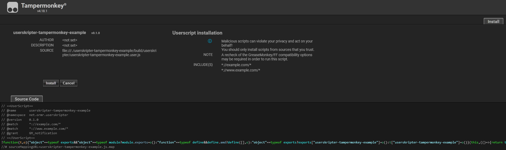

= Userskripter TamperMonkey Example

This project is an example/template repository for how to use https://github.com/userskripter/userskripter[userskripter] to create userscripts for the https://www.tampermonkey.net/[TamperMonkey] script engine.

It's recommended, if possible, to use https://www.tampermonkey.net/[TamperMonkey] instead of GreaseMonkey, as TamperMonkey is more frequently maintained, has better security, and offers more utility functions for developing userscripts.

When using TamperMonkey, it's also possible to create smaller sizes of bundled code, this is due to the fact that TamperMonkey offers an API that does not make use of `Promise`, which allows us to skip using any coroutines, which means that the https://kotlinlang.org/docs/javascript-dce.html[DCE] of the Kotlin/JS compiler can work its wonders and produce a very small js file. This means that even though this project and the greasemonkey example do the exact same thing, by default, this project produces a 9 kB large `\*.user.js` file, while the greasemonkey one produces a 91 kB large `*.user.js` file.

The TamperMonkey api provided by userskripter provides another set of functions extra above those defined inside of `TamperMonkey` and the `NativeTamperMonkey` objects, in the form of the `BlockingTamperMonkey` object.

The `BlockingTamperMonkey` object has the same functions as `TamperMonkey` & `NativeTamperMonkey`, but all of them are "blocking", so no coroutines nor callback hell from using promise based apis is required. All the functions inside of `BlockingTamperMonkey` are also provided in the form of top-level functions with the same name but prefixed with `GM_`, so one can either do `BlockingTamperMonkey.notification(...)` or `GM_notification(...)` and the same API will be used in the end. _(As a matter of fact, all functions inside of `BlockingTamperMonkey` just delegate to their top-level equivalents)_

== Installation

To generate and access the required `*.user.js` file there's two ways:

'''

=== generateUserscript

[source,bash]
----
/.gradlew :generateUserscript
----

And then navigate to the `./build/userskripter/` directory, where you'll see the `userskripter-tampermonkey-example.user.js` file.

`generateUserscript` is a task provided by default as long as you use the userskripter gradle plugin.

=== openUserscriptDirectory

[source,bash]
----
/.gradlew :openUserscriptDirectory
----

If nothing goes wrong then the `./build/userskripter/` directory should be opened when the task finishes executing, inside that directory there should be a `userskripter-tampermonkey-example.user.js` file.

`openUserscriptDirectory` is a custom task defined inside the `build.gradle.kts` file, it depends on the `generateUserscript` task.

'''

If using TamperMonkey _(recommended)_ then all that's needed to install the generated script file is to drag and drop the `userskripter-tampermonkey-example.user.js` file onto a new empty tab in your web browser, which should bring up this page after a second or two:

Just click on the `Install` button and then navigate to https://xxx[example.com] where there should now be a `button` element under the `More Information...` text with the text `Click Me!`. Clicking on the button should bring up a new notification with the title `userskripter-tampermonkey-example` and the text `This is a notification!`.

If you're using GreaseMonkey, then the script will potentially not run properly, or not run at all, as this is designed to use TamperMonkey specific APIs.